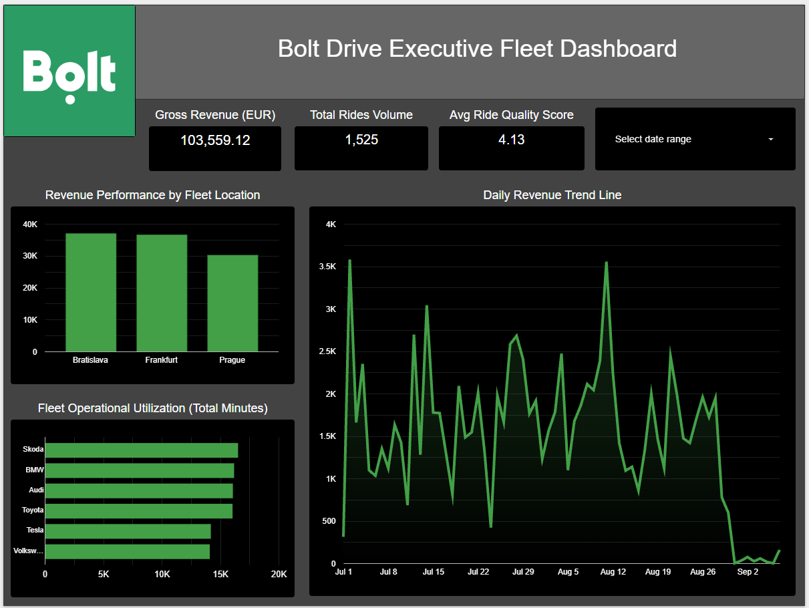

# 🚗 Automated Cloud Data Warehouse & BI Suite for Bolt Drive

A fully automated, production-grade cloud ELT data pipeline and dimensional data warehouse designed for global car-sharing performance tracking. Built entirely on cloud infrastructure to bypass heavy local dependencies and reduce ongoing server maintenance costs to zero.

## 🔗 Live Interactive Dashboard
👉 **[CLICK HERE TO OPEN THE LIVE MANAGEMENT DASHBOARD](https://datastudio.google.com/reporting/489ba77f-5b10-4aea-a723-47137253b3d6)**  
*(Feel free to interact with date ranges and look up specific cities like Prague, Bratislava, or Frankfurt to watch the cloud streaming data recalculate in real-time).*

## 📊 Business Problem Statement
The client (Bolt Drive management) faced severe data fragmentation from their mobile application streams, including:
1. **Currency Chaos:** Raw rides ingested concurrently in multiple currencies (CZK, USD, EUR), skewing total revenue reports.
2. **Text Ingestion Malfunctions:** Data quality crashes due to corrupted text anomalies in numerical price attributes (e.g., `'500.00a'`).
3. **Missing Telematics Analytics:** Lack of pre-computed trip runtime metrics required to analyze asset idling and utilization.

## 🏗️ Architecture & Engineered Solutions

This enterprise ecosystem resolves data quality challenges directly inside the cloud cluster using a 4-stage pipeline approach:

1. **The Ingestion Layer (`raw_rides`):** Direct append-only streaming from car telematics.
2. **The Cloud Delta Engine (`SQL Trigger`):** An independent database webhook monitor listening for incoming transactions 24/7.
3. **Data Sanitization & Validation Shield:** Combines regular expression pattern filtering (`REGEXP_REPLACE`) to eliminate string corruptions, automatically converts local historical exchange rates to pure base currency (`EUR`), and flags unparseable metrics safely as `NULL` without breaking the operational workflow.
4. **The Metrics Semantic View (`view_clean_reporting`):** Blends trip metrics with dimensional registries (`production_cars`, `production_locations`) and formats corrupted rows as explicit business flags labeled **`UNKNOWN`** for dashboard transparency.

## 📁 Repository Structure
* `database_architecture.sql`: Core operational layer housing analytical schemas, data quality validation functions, database webhooks, and executive layer views.
* `README.md`: Structural documentation, business case analysis, and deployment tracking.

* `etl_bolt_drive.py`: Local backup execution script utilized for offline transformations and historical backfills via Python Pandas.

